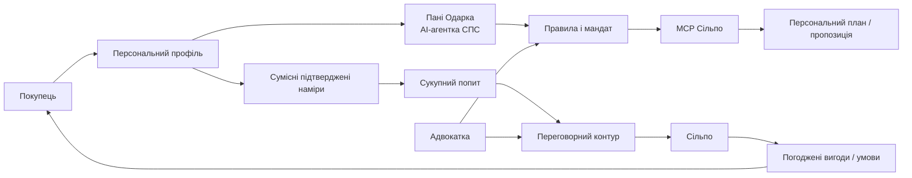
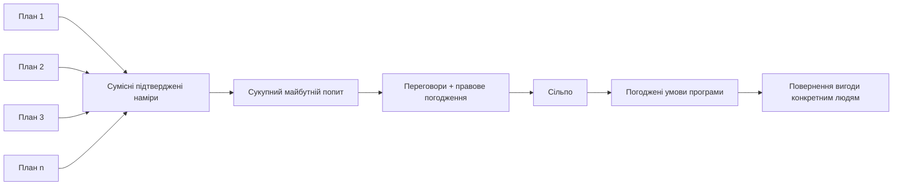

# СПС

**Спільнота покупців супермаркету · персональне планування + колективне представництво попиту**

> **Передбачуваність, яку покупець дає бізнесу, має повертатися покупцеві вигодою.**

> **СПС — це платформа. Пані Одарка — її AI-агентка, а не назва всього продукту.**

`REAL MCP PROTOTYPE` · `2-LAYER MODEL` · `HUMAN-IN-THE-LOOP`

---

## ПАСПОРТ ПРОДУКТУ

| Елемент | Опис |
|---|---|
| **Продукт** | СПС — незалежна платформа довгострокового планування покупок і представництва сумісного попиту. |
| **AI-агентка** | Пані Одарка — персоналізує, уточнює невизначеність, пояснює варіанти та працює лише в межах наданого мандата. |
| **Інтеграція** | Офіційний MCP Сільпо — міст до реальних товарів, категорій, часових слотів і даних магазину у зафіксованому прототипі. |
| **Правовий контур** | Адвокатка представляє інтерес покупця, структурує спільні правила і валідує критичні юридичні вузли. |
| **Другий ярус** | Сумісні підтверджені наміри агрегуються в сукупний попит для переговорів про майбутні умови. |
| **Статус** | Перший ярус має реальний запис MCP-прототипу; колективний ярус і договірна модель — запропонована наступна фаза. |

**Конкурсна рамка:** це запрошення Сільпо до пілоту, а не оголошення погоджених тарифів, знижок, договорів чи зобов'язань мережі.

---

# 01 · ПРОДУКТОВА ЛОГІКА

## Що саме створює СПС

Звичайний кошик відповідає на питання **«що купити сьогодні?»**. СПС додає довший горизонт: **«що цій людині та групі сумісних покупців буде потрібно завтра?»**

### Проблема

- Персональні потреби, бюджет, обмеження та правила заміни часто живуть у голові покупця і щоразу формуються заново.
- Ритейл бачить переважно поточну транзакцію або історичну поведінку, але не підтверджений майбутній намір як окремий економічний сигнал.
- Колективний попит без правового і персонального контуру ризикує перетворити людину на «одиницю обсягу», стимулюючи зайву покупку заради знижки.

### Відповідь СПС

- **Ярус 1:** персональний профіль → план → правила → AI лише там, де є невизначеність → реальні дані через MCP.
- **Ярус 2:** сумісні підтверджені наміри → сукупний попит → переговори із Сільпо → погоджені умови повертаються конкретним людям.
- Навіть у груповій програмі Пані Одарка залишається на боці конкретної людини: якщо програмний пакет більший за її реальну потребу, сервіс не має мотивувати купувати зайве.

**Схема 1.** Пані Одарка є AI-агенткою всередині СПС; платформа охоплює персональний, технологічний, колективний і правовий контури.

---

# 02 · МЕХАНІЗМ РОБОТИ

## Персональний контур: від «примх» до відповідальної дії

| Крок | Вузол | Що відбувається |
|---:|---|---|
| **1** | **Профіль** | Бюджет, регулярні потреби, обмеження, смаки, сезонність, дозволи та «Мої примхи». |
| **2** | **Пані Одарка** | Показує: «Ось як я вас зрозуміла», уточнює лише те, що неоднозначне. |
| **3** | **Правила** | Те, що можна виконати правилом, не передається LLM як вільне рішення. |
| **4** | **Мандат** | AI не може сам розширити повноваження; вихід за межу повертається людині на підтвердження. |
| **5** | **MCP Сільпо** | Дає актуальні дані товарів та інші доступні дані конкретного гостя у межах дозволеного доступу. |
| **6** | **Результат** | Людина отримує пояснений план/пропозицію; фактична покупка не симулюється там, де її немає. |

### Ключова демонстрація мандата

| Правило | У межах мандата | Поза мандатом |
|---|---|---|
| **Заміна до +10%** | **+7%** → виконується, якщо решта правил і бюджет дотримані | **+18%** → `STOP` → потрібна згода людини |

> **Принцип:** «Те, що можна виконати правилом, виконується алгоритмом. AI потрібен там, де є невизначеність».

Пані Одарка має ім’я й візуальну присутність, але не є юридичним суб’єктом і не підміняє волю покупця.

---

# 03 · ДРУГИЙ ЯРУС І ПРАВО

## Коли персональні плани стають колективною силою

### Як працює колективний контур

- Пані Одарка як аналітичний агент платформи може узагальнювати сумісні планові потреби та готувати матеріали для переговорів.
- Маршрут **«власний AI покупця → Пані Одарка»** є запроєктованою майбутньою інтеграцією, а не чинною функцією прототипу.
- До Сільпо має надходити сукупний попит, а не повні персональні профілі. Це принцип проєктної архітектури, а не твердження про доведену анонімність поточної реалізації.
- Комерційні пороги, категорії та вигоди визначаються разом із Сільпо. СПС не оголошує від імені мережі готові знижки чи спеціальні ціни.
- Юридична конструкція відрізняє прогноз від договору: зобов’язання виникає лише після належного погодження та прийняття умов.

### Роль адвокатки

- Представляє інтереси покупців у формуванні та зміні спільних умов.
- Валідує критичні правові вузли, а не перевіряє вручну кожен кошик.
- Ознаки масового або суттєвого порушення можуть ескалуватися Одаркою як пакет фактів; юридичний висновок не оголошується AI автоматично доведеним.
- Правнича допомога й адвокатська таємниця стосуються відповідних відносин адвокат–клієнт; це не автоматичний режим для всіх даних платформи.

> **Сенс другого ярусу:** не «гуртова знижка будь-якою ціною», а економічно значущий сигнал майбутнього попиту, який не стирає персональний інтерес.

### Стани попиту — не змішувати

Кожен перехід означає інший ступінь визначеності. **Прогноз ≠ намір ≠ договір.**

---

# 04 · РЕАЛІЗОВАНИЙ ПРОТОТИП

## Що вже показано на реальних даних, а що є наступною фазою

> **Фактова межа:** у відеопітчі чітко розділено реальний запис MCP-перевірки та запропоновану модель другого ярусу.

### Зафіксована MCP-демонстрація

- Локальна модель `qwen3:4b` розпізнає список потреб; оператор підтверджує потреби Олени.
- Виконано **6 read-only викликів офіційного MCP Сільпо**: список магазинів, категорії, часові слоти та 3 запити товарів для трьох категорій.
- Демонстраційні категорії: **картопля, куряче філе, яйця**.
- У зафіксованому сеансі сума пропозиції — **363,58 грн** за бюджету **500,00 грн**; **136,42 грн — залишок бюджету, а не «економія»**.
- Це перевірена на момент запису пропозиція за тодішніми цінами; резервування, зміна кошика або покупка не здійснювалися.

### Матриця готовності

| Компонент | Статус | Межа твердження |
|---|---|---|
| Read-only MCP інтеграція | **РЕАЛЬНИЙ ЗАПИС** | показано в прототипі |
| Розпізнавання списку + підтвердження оператором | **РЕАЛЬНИЙ ЗАПИС** | показано в прототипі |
| Розрахунок кількостей і перевірка бюджету | **РЕАЛЬНИЙ ЗАПИС** | показано в прототипі |
| Персональний профіль і правила мандата | **ПРОДУКТОВИЙ ПРОТОТИП** | показано як UX/логіка; не заявляється production-автоматизація |
| Власний AI покупця → Пані Одарка | **ЗАПРОПОНОВАНО** | майбутня інтеграція |
| Агрегація майбутнього попиту | **ЗАПРОПОНОВАНО** | другий ярус; потребує спільного пілоту |
| Переговорні програми / знижки | **НЕ ПОГОДЖЕНО** | умови формуються разом із Сільпо |
| Договір / цифровий підпис | **ОКРЕМИЙ НАПРЯМ** | у цьому прототипі не реалізовано |

---

# 05 · ПІЛОТ, АВТОРСТВО, КОМПОНЕНТИ

## Що пропонуємо Сільпо після хакатону

### Пілот: перевірити економіку передбачуваності

- Обрати **1 товарну категорію або вузький сезонний сценарій** і добровільну групу учасників.
- Сільпо визначає комерційні пороги та можливі вигоди; СПС забезпечує персональний контур, фіксацію ступеня наміру, агрегування сумісного попиту й правову модель.
- Почати з базової лінії «до», потім виміряти: чисту вигоду клієнта; витрати обчислень і підтримки; час адвокатки на спільні правила та інциденти; частоту хибних/пропущених ескалацій; кількість відмов; частку фактично виконаного підтвердженого попиту.
- Тривалість, кількість учасників, категорія, поріг і конкретна модель фінансування узгоджуються з Сільпо; у цьому документі вони навмисно не вигадуються.

### Авторство і людино-AI команда

| Учасник | Внесок |
|---|---|
| **Наталія Целовальніченко** | Авторка концепції та правової моделі; адвокатка, кандидатка юридичних наук; керівниця розроблення. |
| **Aiden** | Технічне прототипування, MCP-демонстрація, поточна реалізація та монтаж пітчу. |
| **Aetrem** | Продуктова співархітектура, драматургія пітчу, українська voice-over production, супровідна документація. |
| **Klavr** | MCP-розвідка, технічне й режисерське ревю, контроль масштабу доказу. |

### Компоненти

- **СПС** — продуктова платформа і методологічний контур.
- **Пані Одарка** — AI-агентка платформи.
- **Офіційний MCP Сільпо** — зовнішня інтеграційна інфраструктура Сільпо, використана в read-only демонстрації.
- **Локальна модель `qwen3:4b`** — розпізнавання списку у зафіксованому прототипі.
- **Правила/мандат** — детермінований контур виконання меж делегування; AI підключається там, де є невизначеність.

> **Технічна прозорість:** у цій компактній редакції наведено лише компоненти, підтверджені актуальним пітчем і записом демо. Повний перелік бібліотек, версій та ліцензій формується з технічного manifest прототипу окремо.

---

## ПІДСУМКОВА ФОРМУЛА

**СПС не замінює Сільпо і не дублює MCP. Воно додає те, чого не дає окрема транзакція: довгий горизонт потреб, персональні межі та колективний переговорний сигнал.**

Авторка концепції та правової моделі: **Наталія Целовальніченко**.
