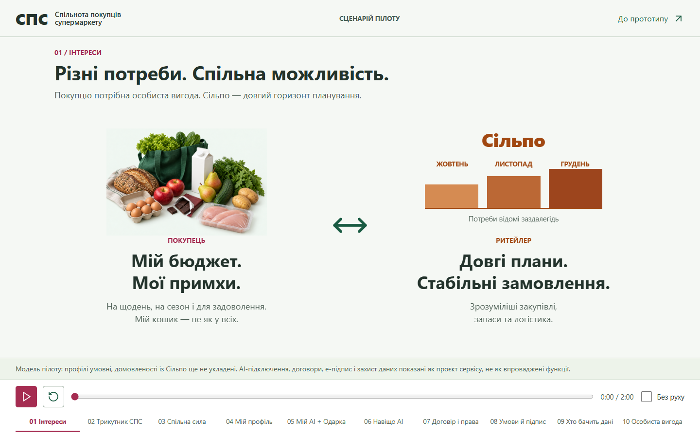
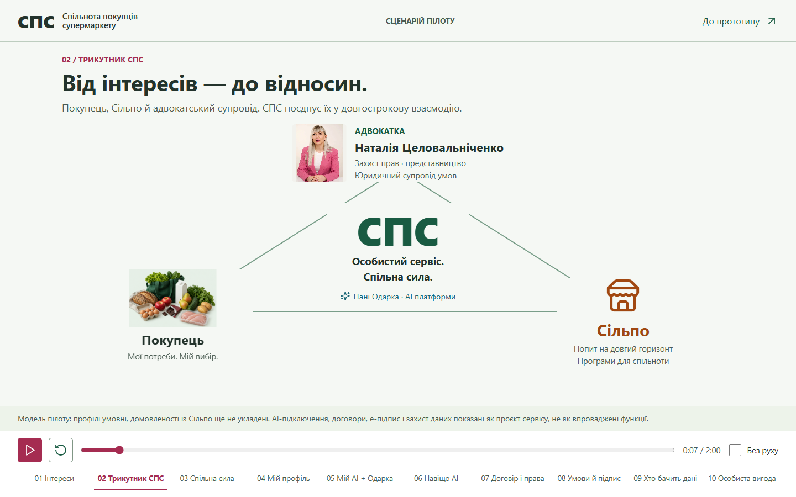
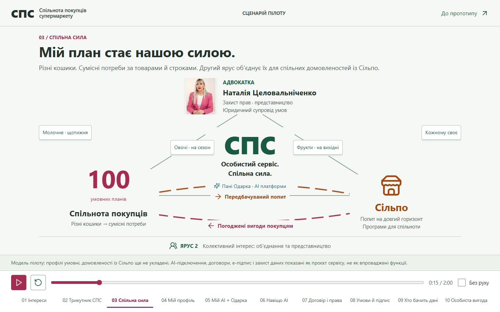
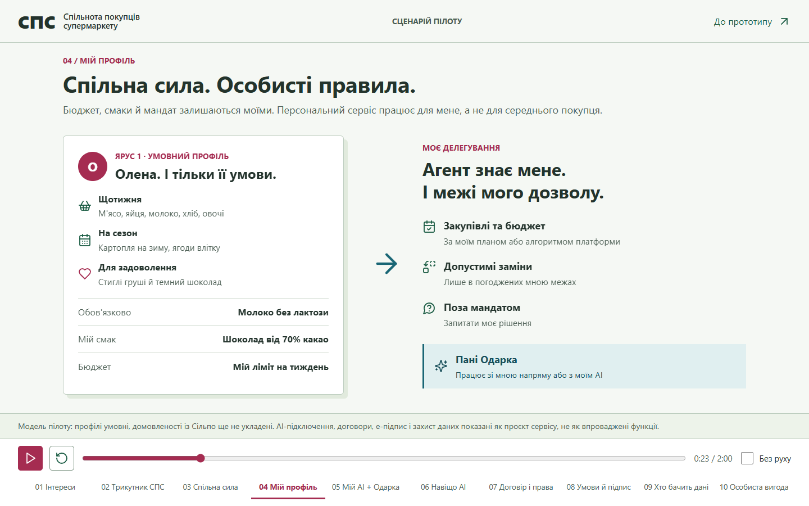
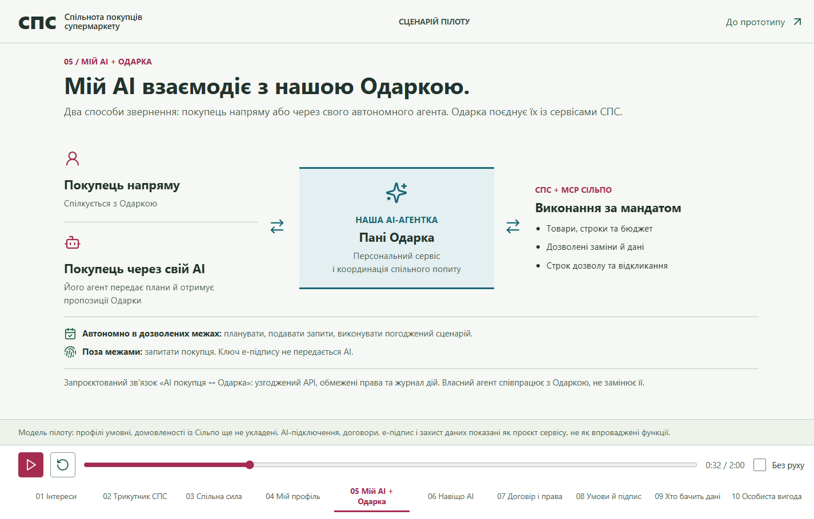
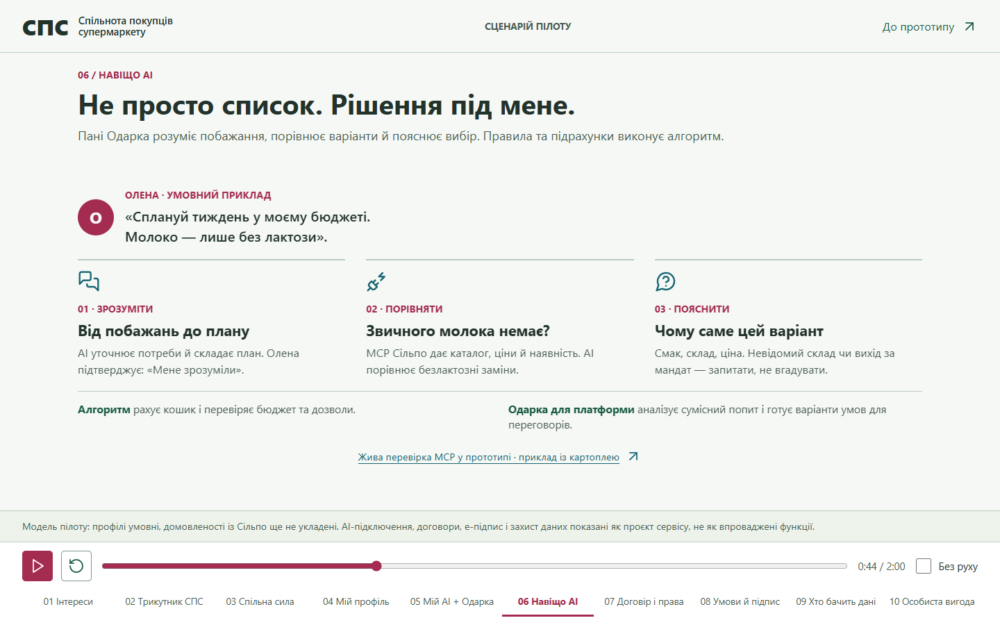
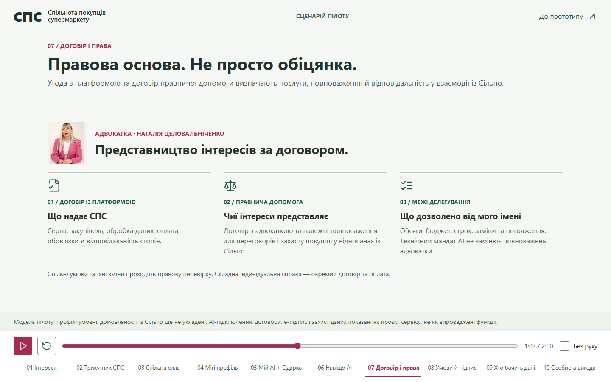
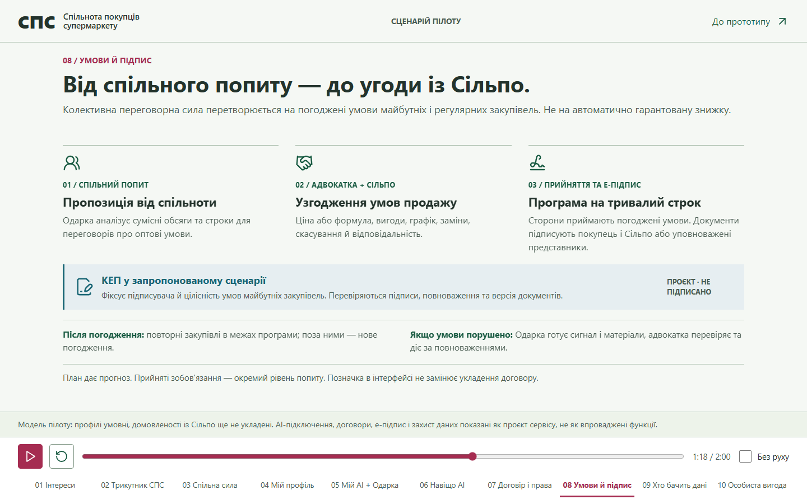
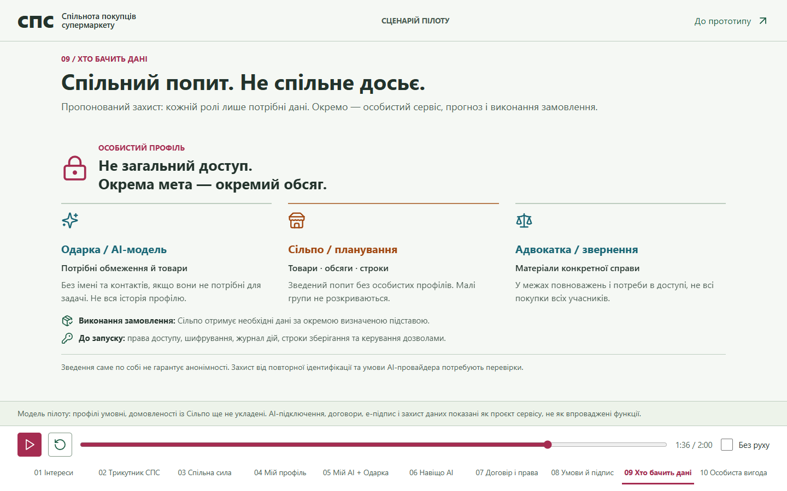
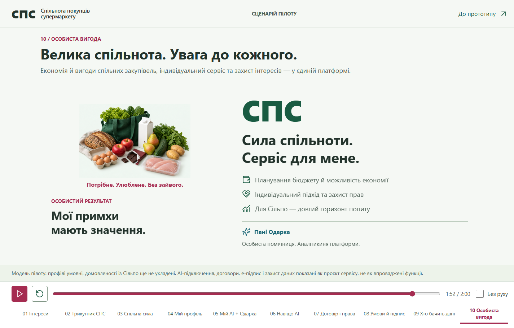

# СПС: версія Ейдена для Аетрема

Поточна двохвилинна анімаційна історія платформи **«Спільнота покупців супермаркету»**, 13.09.2026. Робоча редакція для спільного огляду, не фінальний пітч.

- [Повна анімація одним HTML-файлом](СПС.html?raw=true): завантажити та відкрити у браузері. Зображення, стилі та керування вбудовані; озвучки ще немає.
- [Чесна оцінка Ейдена та питання для агона](ОЦІНКА.md).
- Нижче всі десять кадрів і послідовність задуму. Їх можна переглянути прямо на GitHub без запуску коду.

GitHub тут зберігає файли, але не відтворює HTML-анімацію як сайт. Посилання всередині анімації на живий МСР-прототип працюють лише на вихідному ПК із запущеним сервером. Ключі, авторизація та приватні файли до цього пакета не входять.

## Основна логіка

Особистий план і вигода покупця → об'єднання сумісних планів → передбачуваний попит для Сільпо → переговори про умови → погоджені вигоди конкретним покупцям.

Одарка є АІ-агенткою платформи, а не назвою сервісу. Власний АІ покупця працює **з Одаркою**, не окремо від неї. Адвокатка забезпечує договірну основу, представництво та правовий супровід. Прогноз попиту і прийняті сторонами зобов'язання розрізняються. Домовленості зі Сільпо ще не укладені, економія не гарантована; майбутні інтеграції й засоби захисту позначено як проєктні.

## 01. Інтереси, 0:00

Покупцеві потрібні власний кошик, бюджет і примхи; Сільпо потрібні передбачувані закупівлі та замовлення.

## 02. Трикутник СПС, 0:07

Покупець, Сільпо й адвокатка поєднуються платформою. Пані Одарка є персональною помічницею та аналітикинею платформи.

## 03. Спільна сила, 0:15

Другий ярус: різні індивідуальні плани утворюють сумісний попит для спільних домовленостей. Число 100 є ілюстрацією, не кількістю реальних клієнтів.

## 04. Мій профіль, 0:23

Олена має різноманітні потреби, особистий бюджет, смаки та дозволені заміни. Особистість покупця не губиться в агрегованому попиті.

## 05. Мій АІ + Одарка, 0:32

Покупець взаємодіє напряму або через власного автономного АІ. Обидва шляхи ведуть до Одарки; межі делегування залишаються за покупцем.

## 06. Навіщо АІ, 0:44

АІ інтерпретує побажання, зіставляє заміни й пояснює вибір. Алгоритми рахують бюджет та перевіряють дозволи; МСР надає дані товарів.

## 07. Договір і права, 1:02

Розділено сервісну угоду, договір правничої допомоги й технічний мандат АІ. Нетипова складна справа має окремі умови обслуговування.

## 08. Умови й підпис, 1:18

Спільнота формує пропозицію, адвокатка й Сільпо узгоджують умови, сторони приймають та підписують програму майбутніх закупівель. Це запропонований, ще не виконаний сценарій.

## 09. Хто бачить дані, 1:36

Для персонального сервісу, планування, виконання замовлення та правничої допомоги потрібні різні обсяги даних. Агрегування саме по собі не гарантує анонімності.

## 10. Особиста вигода, 1:52

Спільна сила повертається в індивідуальний сервіс, можливість економії й захист прав. Сільпо отримує довший горизонт планування попиту.

## Межі цієї редакції

Ейден оцінює дизайн на 5/10, анімаційну розповідь на 4/10. Незалежний текстовий огляд дав 9/10 за повноту сенсів і 6/10 за зрозумілість. Основна проблема: забагато читання замість показу подій. Наступна редакція має зберегти масштаб задуму, але провести глядача через один зрозумілий шлях Олени.

Піктограми Lucide v0.468.0: [ліцензія](LUCIDE-LICENSE.txt). Зображення кошика ілюстративне; портрет адвокатки є кадром підготовленого аватара, наданого для цього пітчу.
